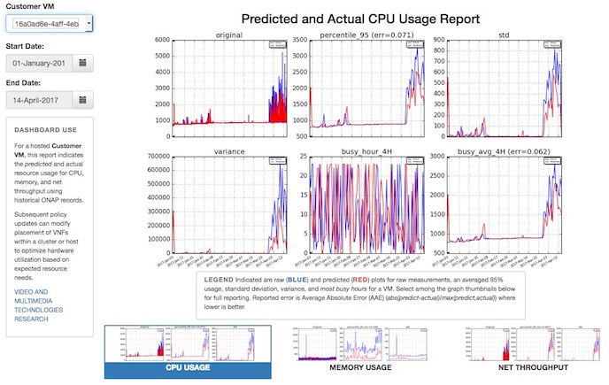

<!--
.. ===============LICENSE_START=======================================================
.. Acumos CC-BY-4.0
.. ===================================================================================
.. Copyright (C) 2017-2018 AT&T Intellectual Property & Tech Mahindra. All rights reserved.
.. ===================================================================================
.. This Acumos documentation file is distributed by AT&T and Tech Mahindra
.. under the Creative Commons Attribution 4.0 International License (the "License");
.. you may not use this file except in compliance with the License.
.. You may obtain a copy of the License at
..
..      http://creativecommons.org/licenses/by/4.0
..
.. This file is distributed on an "AS IS" BASIS,
.. WITHOUT WARRANTIES OR CONDITIONS OF ANY KIND, either express or implied.
.. See the License for the specific language governing permissions and
.. limitations under the License.
.. ===============LICENSE_END=========================================================
-->

# Web Demo
This web page visualizes reports for policy optimization of hosted
customer VMs.  Interested readers in more background for the exploration of
this task can continue to the [next lesson](lesson3.md).

## Running Example
This demonstration web page shows plots of predicted and historical resource
values for memory, CPU, and network throughput from actual customer VMs
running a firewall VNF.

Interact with the demo by selecting a different **Customer VM**,
changing the start or end date for analysis, or clicking on the
summarized graphs at the bottom of the page.

In future versions, these plotted graphs will be populated by a running
instance or by retrieving recent historical predictions and values from
a live database.

* 

## Web Technologies
For interactions, this page uses open-source web technologies like
[bootstrap-3.3.7](http://getbootstrap.com/getting-started/#download),
[AngularJS 1.6.1](https://angularjs.org/),
[jQuery 3.2.1](https://jquery.com/download/),
and [UI Bootstrap 2.5](https://angular-ui.github.io/bootstrap/#!#getting_started).

